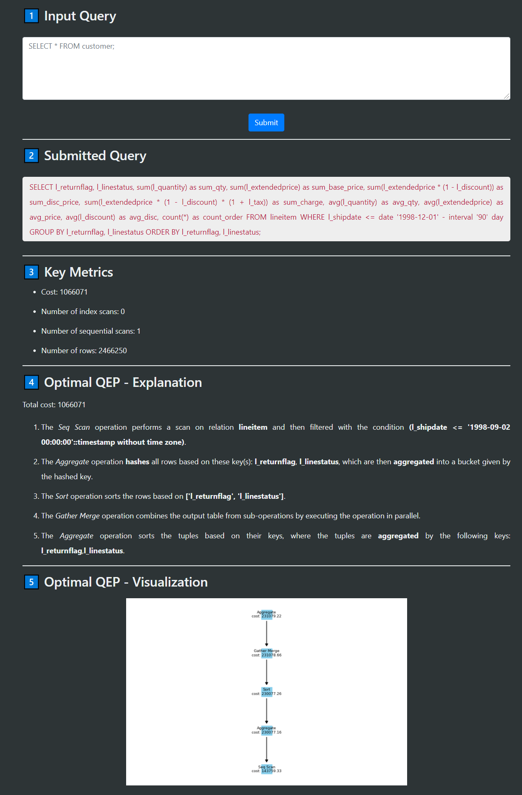

# QEP Visualizer



`QEP Visualizer` is a query execution plan (QEP) visualiser app for annotating SQL queries and generating the QEP in a graphical format for easier interpretation.

## Raw Data

`QEP Visualizer` utilizes the [TPC-H](http://www.tpc.org/tpch/) dataset.

## Setup Instructions

The easiest way to do development on this repo is to use docker. Download docker desktop [here](https://www.docker.com/products/docker-desktop) and set up as per instructions.

1. Download TPC-H CSV files from [here](https://entuedu-my.sharepoint.com/:f:/g/personal/wtan132_e_ntu_edu_sg/Etinqk4fV0BAildPoIy--rABChPN2_kK0jSsGmd2b1zVrQ?e=fr7tzk)

2. Copy all the downloaded CSV files into the folder `<project-root>/sql/data/`

3. Run `docker-compose build && docker-compose up` to build and run the docker containers for both the Postgres (database) instance and the Flask (application server) instance.

4. Head to [url](http://localhost:5000/)

NOTE: Ensure that your docker engine has  >5GB space, otherwise the copying of all TPC-H data into the Postgres database will fail.

## To run unit tests

1. Install dependencies via `pipenv` in a virtual environment and activate it
```
pipenv install # install dependencies in virtual environment
pipenv shell # activate virtual environment
```

2. Run the Flask instance:

```
python client.py
```

3. Head to [url](http://localhost:5000/) 

## FAQ

Q: Why is `docker-compose build && docker-compose up` taking so long?

```
Initial build takes a long time due to the large amount of data being copied into the Postgres database. This process can take anywhere from 5 - 10 minutes.

Upon success, you should see the logs in the terminal reporting that the Flask server running on port 5000, along with a debugger PIN.
```

Q: How do I change the database used by the application?

```
1. Change all instances of `tpch-db` to `your-database-name` in `docker-compose.yml`, `.docker/start.sh`, and `.envs/dev.env`

2. Change the table creation SQL scripts in `.docker/docker-compose.yml`

3. Download the data locally into the `sql/data` folder

4. Repeat Steps 1 - 4 in `Setup Instructions` above for this new dataset
```